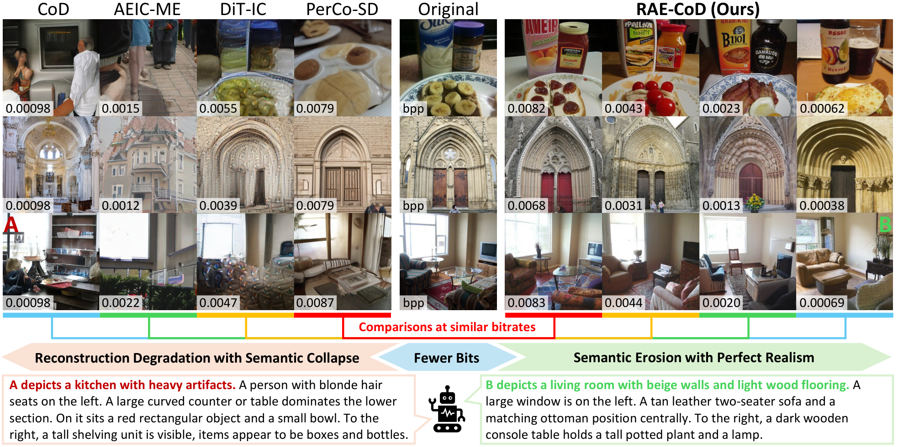
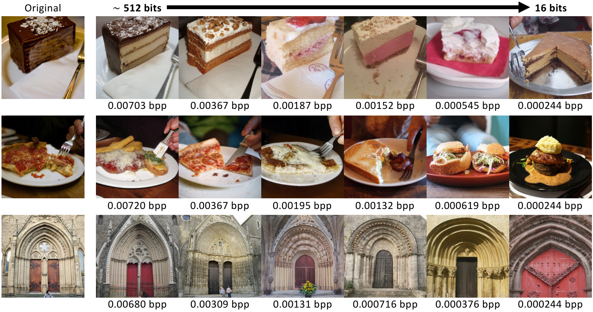
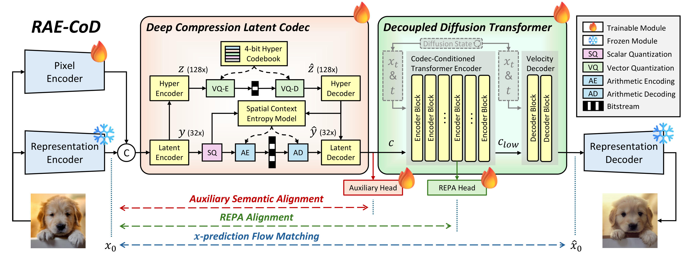

<h2 align="center">Rethinking Generative Image Compression at Extremely Low Bitrates</h2>


<p align="center">
  <a href="https://arxiv.org/abs/2609.39315"></a>
  <a href="https://github.com/LuizScarlet/RAE-CoD"></a>
  <a href="https://huggingface.co/LuizScarlet/RAE-CoD/tree/main"></a>
</p>

<p align="center">
  <a href="https://arxiv.org/abs/2609.39315">Paper</a> |
  <a href="https://huggingface.co/LuizScarlet/RAE-CoD/tree/main">Models</a> |
  <a href="dataset/README.md">Dataset</a> |
  <a href="vfm_eval/README.md">VFM Evaluation</a> |
  <a href="vlm_eval/README.md">VLM Evaluation</a>
</p>

---

### 📖 Introduction

- Generative image codecs can synthesize plausible details at low rates, but what happens in the interval between their normal operating range and **zero bits**?  

- When representative codecs are pushed into this regime, they often fail abruptly: objects deform, salient entities disappear, and scenes become unrecognizable. We call this behavior **semantic collapse**.

- **RAE-CoD constructs compression-oriented diffusion in a representation autoencoder space.** It preserves recognizable, naturally structured content while consistency decreases gradually as the bitrate approaches zero.

<p align="center">
  
</p>


### ✨ Highlights

- 🧠 **Representation-space compression.** RAE-CoD performs diffusion in the semantically structured DINOv3/RAEv2 space rather than pixel space or a reconstruction-oriented VAE latent space.
- 🎯 **Direct semantic condition alignment.** The compressed condition is aligned with the clean source representation without a pixel reconstruction target under the severe bottleneck.
- 🪶 **As few as 16 bits.** The dedicated endpoint transmits four 4-bit VQ indices for a 256×256 image (`0.000244` bpp) and still generates recognizable, naturally structured content.
- 📉 **Graceful semantic degradation.** Semantic recognizability and quality remain nearly stable while source consistency falls smoothly, moving from reconstruction toward source-conditioned generation instead of malformed collapse.
- 📊 **Semantic evaluation beyond distortion.** The release includes a five-VFM protocol and a blinded VLM protocol that separately measures semantic recognizability, quality, and consistency.

<p align="center">
  <a href="assets/visual_examples.pdf"></a>
</p>


### 🏗️ Framework

RAE-CoD combines a frozen representation autoencoder, a deep compression latent codec, and a codec-conditioned decoupled diffusion transformer. All learning objectives are defined in representation space.

<p align="center">
  
</p>


### 📦 Checkpoints
All released files contain the **EMA denoiser state used for inference**. They do not duplicate the frozen DINOv3 encoder, RAEv2 decoder, or RAEv2 normalization statistics; please obtain those assets from the official [RAEv2](https://github.com/nanovisionx/RAEv2) release.

| Checkpoint | Codec mode | 
|---|---|
| [RAE_CoD_ft12.pt](https://huggingface.co/LuizScarlet/RAE-CoD/blob/main/RAE_CoD_ft12.pt) | Standard | 
| [RAE_CoD_ft16.pt](https://huggingface.co/LuizScarlet/RAE-CoD/blob/main/RAE_CoD_ft16.pt) | Standard | 
| [RAE_CoD_ft24.pt](https://huggingface.co/LuizScarlet/RAE-CoD/blob/main/RAE_CoD_ft24.pt) | Standard | 
| [RAE_CoD_ft32.pt](https://huggingface.co/LuizScarlet/RAE-CoD/blob/main/RAE_CoD_ft32.pt) | Standard | 
| [RAE_CoD_ft48.pt](https://huggingface.co/LuizScarlet/RAE-CoD/blob/main/RAE_CoD_ft48.pt) | Standard | 
| [RAE_CoD_16vq.pt](https://huggingface.co/LuizScarlet/RAE-CoD/blob/main/RAE_CoD_16vq.pt) | VQ-only | 

Download all checkpoints with the Hugging Face CLI:

```bash
pip install -U huggingface_hub
hf download LuizScarlet/RAE-CoD \
  RAE_CoD_ft12.pt RAE_CoD_ft16.pt RAE_CoD_ft24.pt \
  RAE_CoD_ft32.pt RAE_CoD_ft48.pt RAE_CoD_16vq.pt \
  --local-dir checkpoints
```

### 🛠️ Installation

The release was validated with Python 3.12, PyTorch 2.5, CUDA 12.x, and four NVIDIA A100 GPUs for training.

```bash
git clone https://github.com/LuizScarlet/RAE-CoD.git
cd RAE-CoD

conda create -n rae-cod python=3.12 -y
conda activate rae-cod
# Install the PyTorch build appropriate for your CUDA platform first.
pip install -r requirements.txt
```

Prepare the following upstream assets:

- a local clone of the official [DINOv3](https://github.com/facebookresearch/dinov3) repository and `dinov3_vitl16_pretrain_lvd1689m-8aa4cbdd.pth`;
- the DINOv3-L/16 RAEv2 DDT checkpoint (`checkpoint.pt`);
- the matching frozen RAEv2 image decoder (`decoder.pt`); and
- the matching RAEv2 channel statistics (`stats.pt`).

The VFM and VLM evaluators are independent subprojects with their own setup instructions and environments.

### 🚀 Inference

Inputs must be 256×256 unless `--resize-images` is supplied. The checkpoint structure is detected automatically.

```bash
python infer_rae_cod.py \
  --ckpt checkpoints/RAE_CoD_ft12.pt \
  --image-dir /path/to/images_256 \
  --output-dir outputs/ft12 \
  --decoder-path /path/to/raev2/decoder.pt \
  --stats-path /path/to/raev2/stats.pt \
  --dinov3-repo-dir /path/to/dinov3 \
  --dinov3-ckpt-dir /path/to/dinov3_weights \
  --num-steps 100 --ig-scale 1.78
```

For the fixed 16-bit model, replace the checkpoint and assert its codec structure with `--hyper-only`.

### 🏋️ Training

Training uses 256×256 images. For ordinary files, provide a root directory and a text file containing one relative image path per line.

| Stage | Trainable modules | Rate objective | Default steps | Learning rate |
|:---:|---|---|:---:|:---:|
| Stage I | Codec, condition projection, rank-32 LoRA, output interfaces | Progressive `0.1 → 2 → 12 → 16 → 24 → 32 → 48` | 180K | `1e-4` |
| Stage II | Codec and full DDT | Fixed in `{12, 16, 24, 32, 48}` | 100K | `1e-5` |
| 16-bit adaptation | VQ-only codec and full DDT | Disabled; payload fixed at 16 bits | 100K | `1e-5` |

A complete Stage-I → Stage-II run for the default rate-12 model is:

```bash
python train_rae_cod.py \
  --train-root /path/to/training/images \
  --train-metadata /path/to/train.txt \
  --eval-root /path/to/validation_256 \
  --output-dir /path/to/experiments \
  --experiment-name rae_cod_rate12 \
  --dinov3-repo-dir /path/to/dinov3 \
  --dinov3-ckpt-dir /path/to/dinov3_weights \
  --pretrained-dit /path/to/raev2/checkpoint.pt \
  --rae-decoder /path/to/raev2/decoder.pt \
  --rae-stats /path/to/raev2/stats.pt \
  --run-stage all --stage2-rate 12 --gpus 4
```

For another fixed-rate model, initialize Stage II from the corresponding
Stage-I checkpoint:

```bash
python train_rae_cod.py [data and weight arguments above] \
  --run-stage stage2 \
  --stage2-rate 12 \
  --stage2-checkpoint /path/to/rate12_stage1.ckpt \
  --experiment-name rae_cod_rate12
```

The fixed 16-bit model starts from the rate-48 Stage-II checkpoint:

```bash
python train_rae_cod.py [data and weight arguments above] \
  --run-stage vq \
  --vq-source-checkpoint /path/to/rate48_stage2.ckpt \
  --experiment-name rae_cod_16vq
```


### 📊 Evaluation

#### MSCOCO-30K

[dataset/README.md](dataset/README.md) documents the exact 30,000-image list, COCO 2014 selection procedure, checksum, and deterministic shortest-side resize plus 256×256 center crop used by the paper.

#### VFM Evaluation

The standalone [vfm_eval](vfm_eval/README.md) package evaluates Inception-v3, DINOv2, SigLIP2, CLIP, and ConvNeXt-v2 and reports paired MSE, relative MSE, cosine similarity, and distributional Fréchet distance. It also computes the five-model aggregates `RelMSE^5`, `COS^5`, and `FDr^5`; the fixed AEIC-ME FD anchor is included in the folder.


#### VLM Evaluation

The standalone [vlm_eval](vlm_eval/README.md) package uses a blinded Qwen3.5-9B judge to report:

- **SR:** semantic recognizability from the reconstruction alone;
- **SQ:** semantic quality including coherence, structure, naturalness, and artifact severity; and
- **SC:** semantic consistency between independently extracted source and reconstruction inventories.

SR and SQ use per-image JPEG–identity normalization, while SC is directly source matched. 

<!-- ### 📝 Citation

If you find this project useful, please cite:

```bibtex
@article{zhang2026rethinking,
  title   = {Rethinking Generative Image Compression at Extremely Low Bitrates},
  author  = {Zhang, Tianyu and Jia, Zhaoyang and Li, Houqiang and Liu, Dong},
  journal = {arXiv preprint arXiv:2609.39315},
  year    = {2026}
}
``` -->

### 🙏 Acknowledgements

This project builds on the official [CoD](https://github.com/microsoft/GenCodec/tree/main/CoD) training framework and the official [RAEv2](https://github.com/nanovisionx/RAEv2) representation autoencoder and diffusion release. We thank all the authors and maintainers for their contributions.

